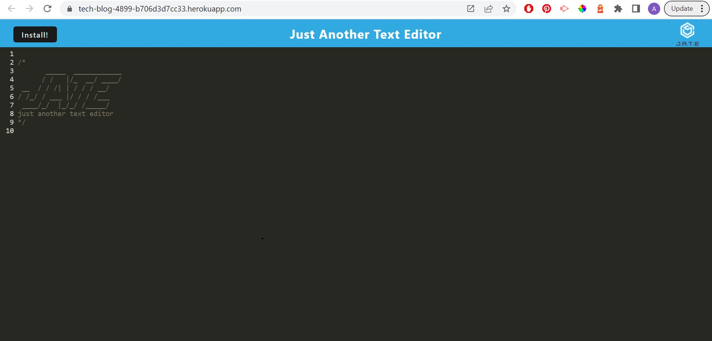

# 19-Text-Editor

## Description

  A PWA text editor utilizing service workers and IndexedDB API.  Application allows the user to type coding notes with JavaScript syntax highlighting.

  
  
  
  
  

  
## Table of Contents

  1. [Installation](#installation)
  2. [Usage](#usage)
  3. [License](#license)
  4. [Contribution](#contribution)
  5. [Testing](#testing)

## Installation

  npm install

## Usage

  n/a

## License

  None

## Contribution

  n/a

## Testing

  n/a

## Questions
  Email me at [abilivick@gmail.com](mailto:abilivick@gmail.com) or explore more projects at [lailiel](https://www.github.com/lailiel)
